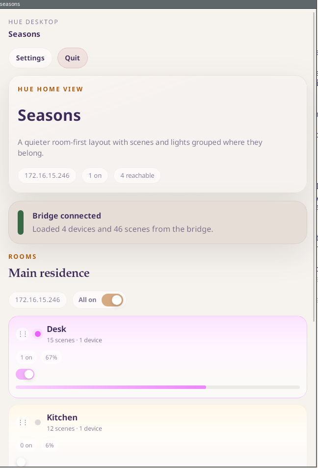
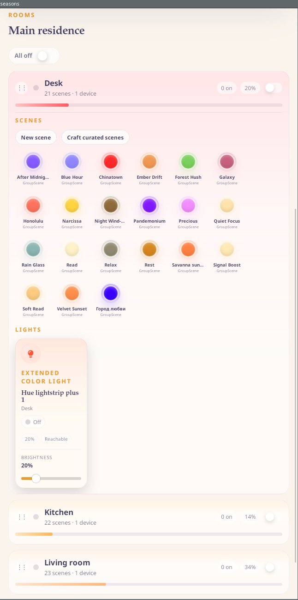
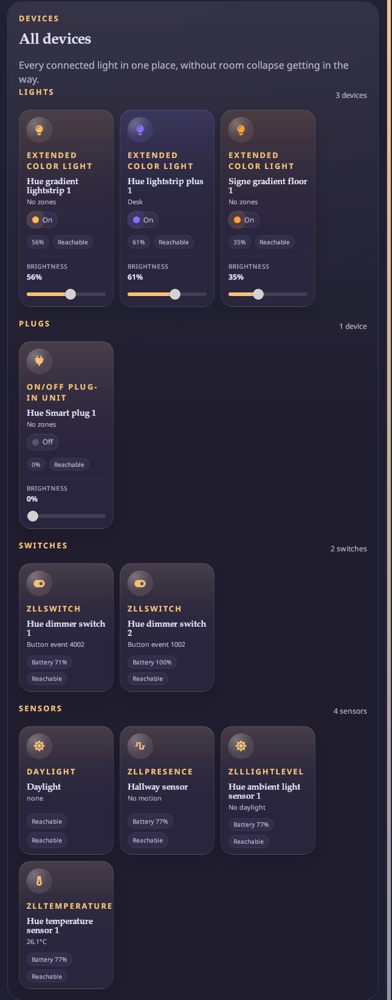
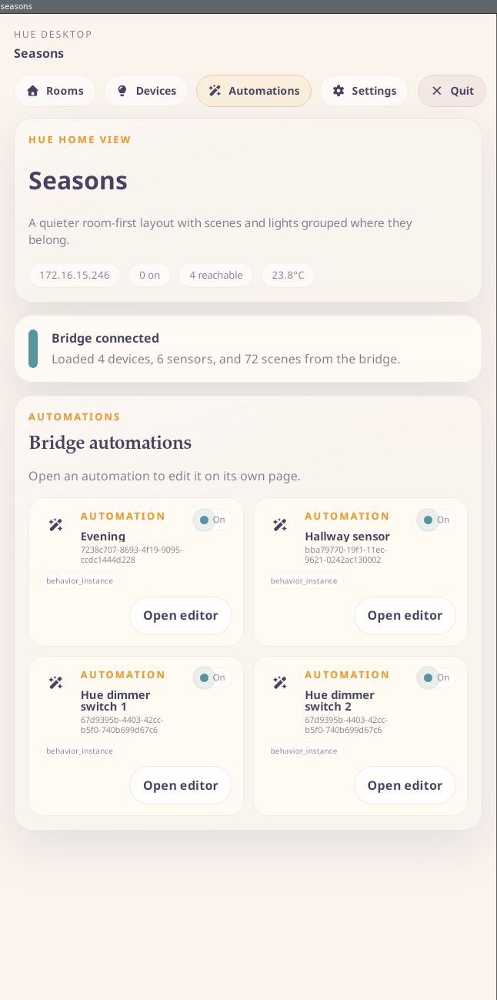
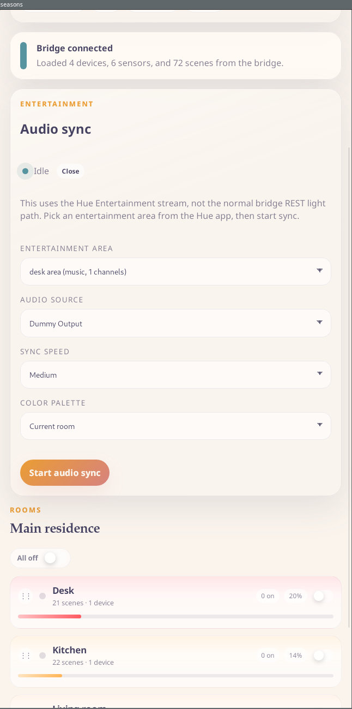
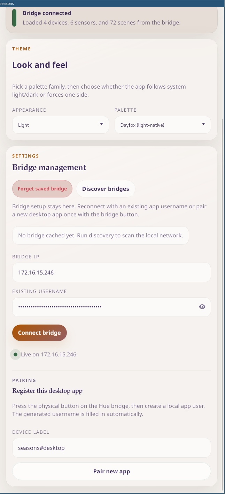

Seasons
-------

An unofficial cross-platform Tauri app for controlling Philips Hue lights, devices, scenes, automations, and Entertainment audio sync.

The project is primarily aimed at Linux, especially for features that are usually better covered by the macOS Hue desktop app.

## Features

- Room-first Hue control UI
- Scene browsing, activation, creation, and deletion
- Device controls grouped by room or by type
- Hue automations with dedicated editing flows
- Entertainment audio sync over PipeWire on Linux

## Overview

Seasons is built around five top-level pages:

- `Rooms` for the day-to-day room view and scene control
- `Devices` for all controllable hardware grouped by type
- `Automations` for Hue behavior instances and schedules
- `Settings` for bridge management and theme selection
- `Audio sync` as a collapsible control surface on the main page



## Walkthrough

### Rooms

The main page is room-first. Each room stays compact until you open it, then shows:

- current on/off state
- room brightness
- scene chips with bridge-derived colors
- room lights and per-device controls

The room header is meant to be the fast control surface: you can toggle the room, set brightness, then open it only when you need scenes or individual devices.



### Devices

The `Devices` page pulls everything into one place and groups it by function instead of room. That makes it easier to find hardware that does not belong to the normal room-light flow, such as plugs, switches, and sensors.

Current grouping is:

- `Lights`
- `Plugs`
- `Switches`
- `Sensors`



### Automations

The `Automations` page lists bridge automations and lets you open them into a dedicated editor flow. From there you can inspect the bridge payload, edit supported configuration fields, and toggle the automation without leaving the app.

The app also surfaces the bridge-reported automation type, so the UI reflects what Hue actually exposes instead of inventing its own categories.



### Audio sync

Audio sync uses Hue Entertainment, not the normal REST light path. The sync controls live on the main page so they are close to the rooms they affect.

To use it:

1. Create a Hue Entertainment area in the official Hue app.
2. Pick that entertainment area in Seasons.
3. Pick the PipeWire output to capture.
4. Choose sync speed and color palette.
5. Start sync.

`Current room` uses the active room palette as the sync color base. Other palettes are available when you want a fixed sync look instead.



### Settings

`Settings` is kept narrow on purpose. It covers:

- theme family and light/dark/system mode
- saved bridge management
- reconnecting with an existing username
- pairing a new local bridge app user

The app persists its state in platform-appropriate config/data locations instead of browser local storage.



## Linux dependencies

You need both the normal Tauri/WebKitGTK build stack and the PipeWire development package for audio sync.

### Debian / Ubuntu

```bash
sudo apt update
sudo apt install \
  build-essential \
  curl \
  file \
  libayatana-appindicator3-dev \
  librsvg2-dev \
  libssl-dev \
  libwebkit2gtk-4.1-dev \
  libxdo-dev \
  libpipewire-0.3-dev
```

### Fedora

```bash
sudo dnf install \
  cairo-gobject-devel \
  gcc-c++ \
  glib2-devel \
  gtk3-devel \
  libappindicator-gtk3-devel \
  libxdo-devel \
  openssl-devel \
  pipewire-devel \
  pkgconf-pkg-config \
  webkit2gtk4.1-devel
```

### Arch Linux

```bash
sudo pacman -S --needed \
  base-devel \
  libappindicator-gtk3 \
  libpipewire \
  openssl \
  webkit2gtk-4.1 \
  xdotool
```

## macOS dependencies

For macOS desktop development, install the Xcode Command Line Tools:

```bash
xcode-select --install
```

Audio sync on macOS uses ScreenCaptureKit and links against the system Swift runtime. In practice, that means:

- install Xcode Command Line Tools at minimum
- if you use a full Xcode install, launch it once so setup completes
- if you have multiple Xcode installs, make sure `xcode-select -p` points at a valid Xcode or Command Line Tools directory

macOS audio sync also requires Screen Recording permission at runtime.

## Rust / frontend tools

```bash
rustup target add wasm32-unknown-unknown
cargo install tauri-cli --version "^2.0.0" --locked
cargo install trunk
cargo install wasm-bindgen-cli --version 0.2.117
```

## Development

Run the app with:

```bash
cargo tauri dev
```

On some Linux graphics stacks, WebKitGTK needs the DMA-BUF renderer disabled:

```bash
WEBKIT_DISABLE_DMABUF_RENDERER=1 cargo tauri dev
```

## Build

```bash
cargo tauri build
```

## Notes

- Entertainment audio sync requires a Hue Entertainment area created in the official Hue app.
- Entertainment audio sync on Linux currently uses PipeWire output capture.
- Entertainment audio sync on macOS uses ScreenCaptureKit system audio capture and requires Screen Recording permission.
- The macOS binary now points `@rpath` at `/usr/lib/swift` to avoid loading duplicate Swift runtimes from Xcode toolchains.
- The saved bridge session and app state are stored in XDG config/data locations, not in browser local storage.
